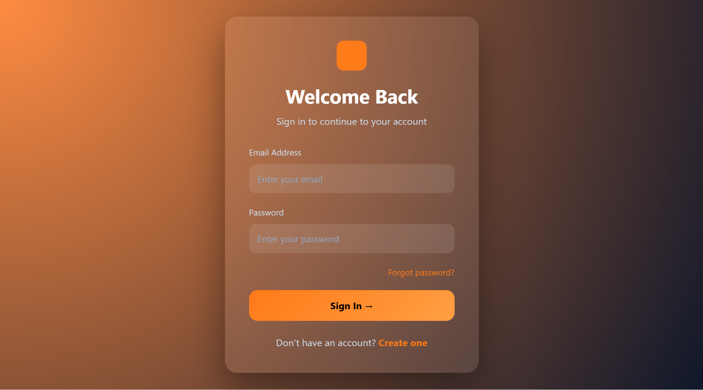
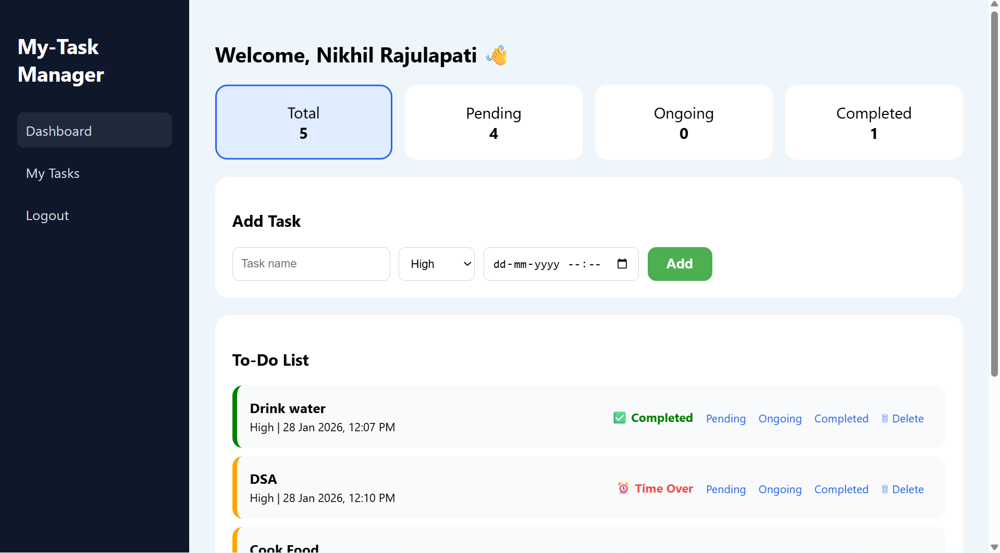
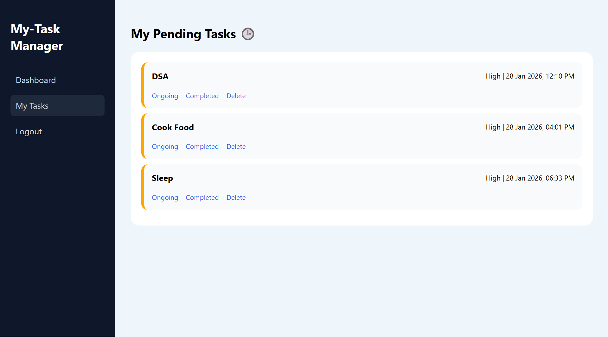

# Task Manager Web Application


A simple **Task Manager Web Application** built using **PHP, MySQL, HTML, CSS, and JavaScript**.
This project allows users to **register, log in, manage tasks, and track their assigned work** through a clean dashboard interface.

It is designed to demonstrate **basic web development concepts such as authentication, database integration, and task management systems**.

---

## 🚀 Features

* User Registration
* Secure Login & Logout
* Task Dashboard
* Create Tasks
* View Assigned Tasks
* Task Notifications
* Clean and Simple UI
* MySQL Database Integration

---

## 🛠️ Tech Stack

**Frontend**

* HTML
* CSS
* JavaScript

**Backend**

* PHP

**Database**

* MySQL

---

## 📂 Project Structure

```
task-manager
│
├── assets
│   ├── css
│   │   ├── dashboard.css
│   │   └── style.css
│   │
│   └── js
│       └── notify.js
│
├── auth
│   ├── login.php
│   ├── register.php
│   └── logout.php
│
├── config
│   └── db.php
│
├── pages
│   ├── dashboard.php
│   ├── tasks.php
│   └── my-tasks.php
│
├── README.md
└── index.php
```

---

## ⚙️ Installation

### 1. Clone the repository

```
git clone https://github.com/nikhilrajulapati4689/task-manager.git
```

### 2. Move project to XAMPP / WAMP

Place the folder inside:

```
htdocs
```

Example:

```
C:/xampp/htdocs/task-manager
```

---

### 3. Create Database

Open **phpMyAdmin** and create a database:

```
task_manager
```

---

### 4. Configure Database Connection

Edit:

```
config/db.php
```

Example:

```php
$host = "localhost";
$user = "root";
$password = "";
$database = "task_manager";
```

---

### 5. Run the Project

Open browser:

```
http://localhost/task-manager
```

---

## 📸 Screenshots

### Login Page


### Dashboard


### Task Page


## 📌 Future Improvements

* Task deadline reminders
* Email notifications
* Task priority system
* Admin panel
* API integration
* Responsive mobile design

---

## 👨‍💻 Author

**Nikhil Rajulapati**

AI & Machine Learning Student
Web Developer | Freelancer

GitHub:
https://github.com/nikhilrajulapati4689

---

## ⭐ Support

If you like this project, consider giving it a **star ⭐ on GitHub**.

---
# Developed by
**Nikhil Rajulapati** 

AI & Machine Learning Student  
Vignan's Foundation for Science, Technology and Research
